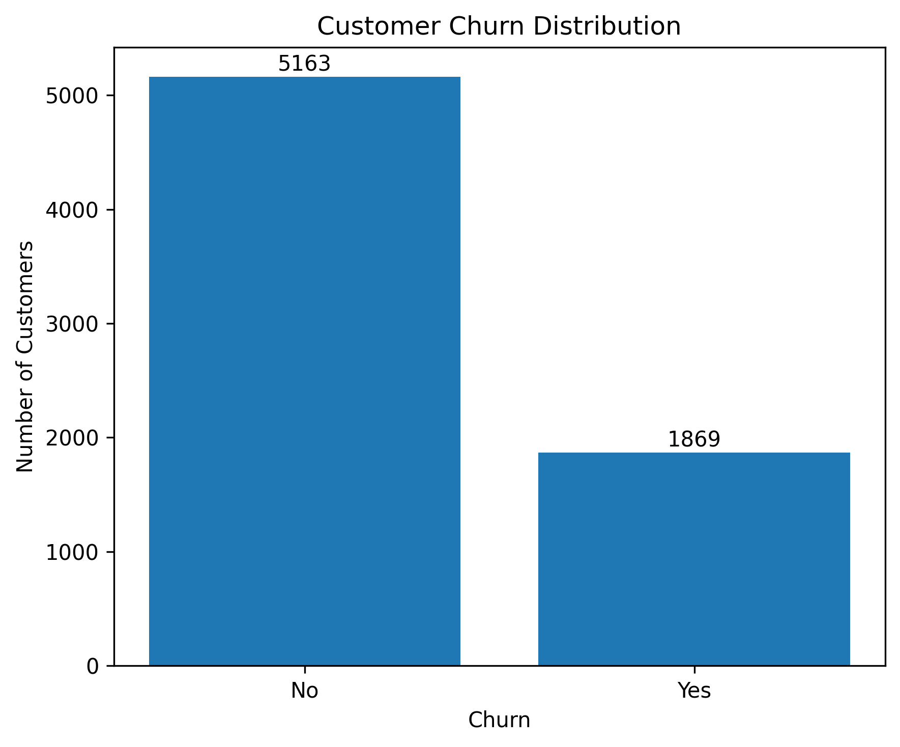
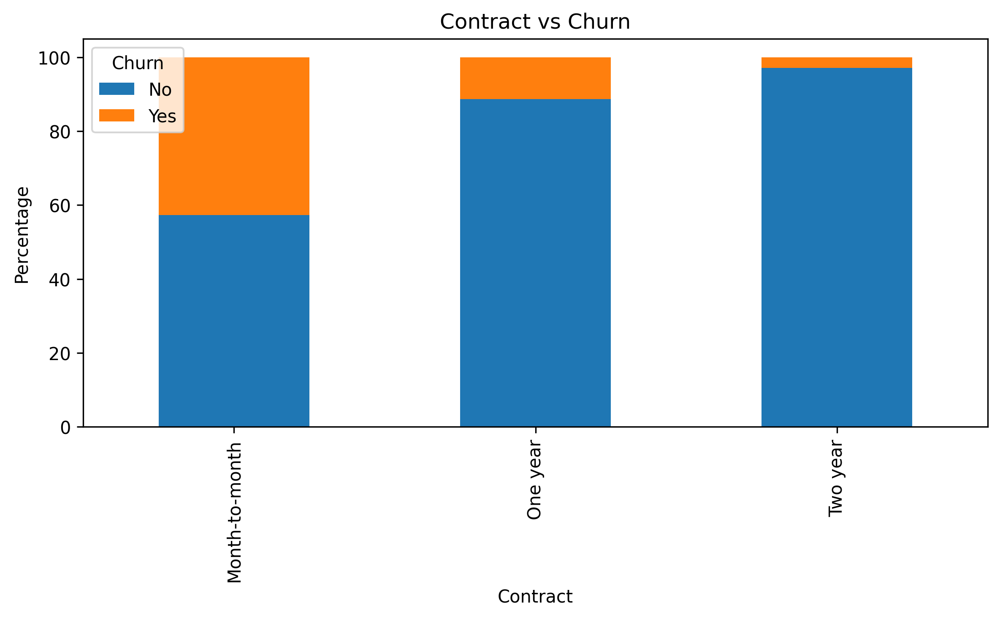
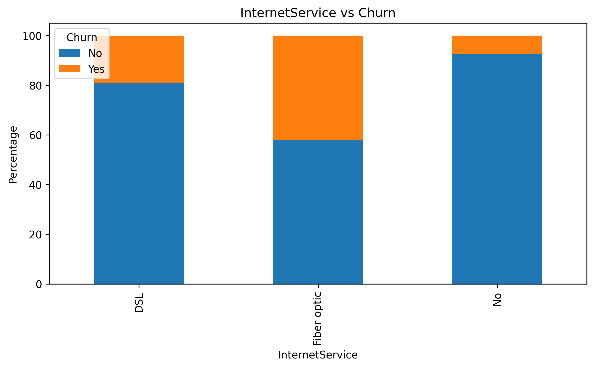
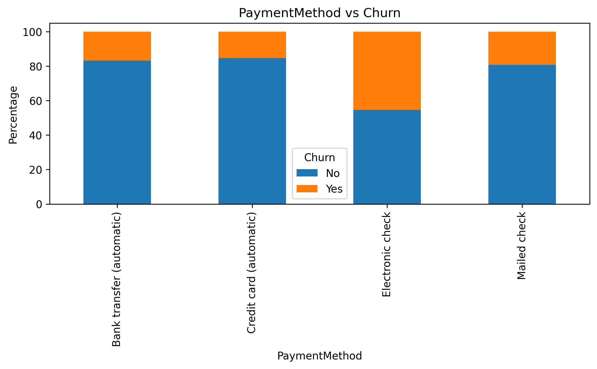
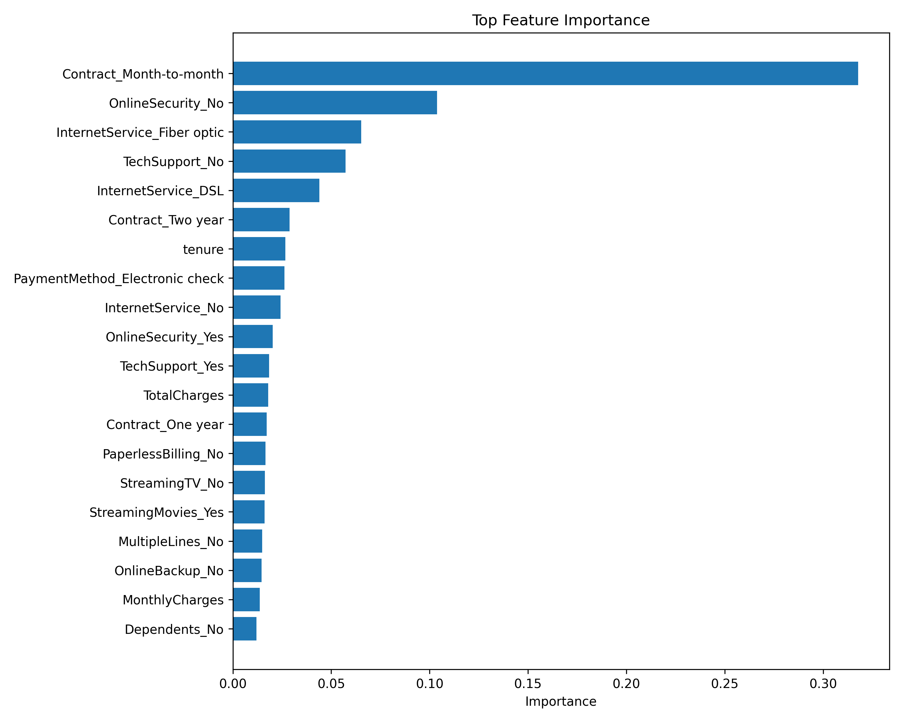
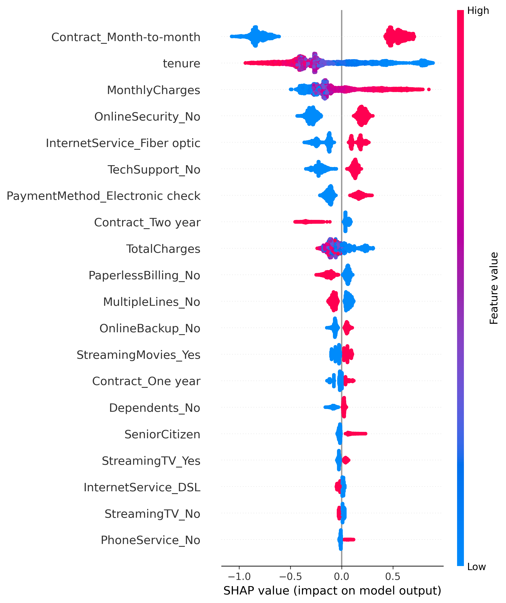
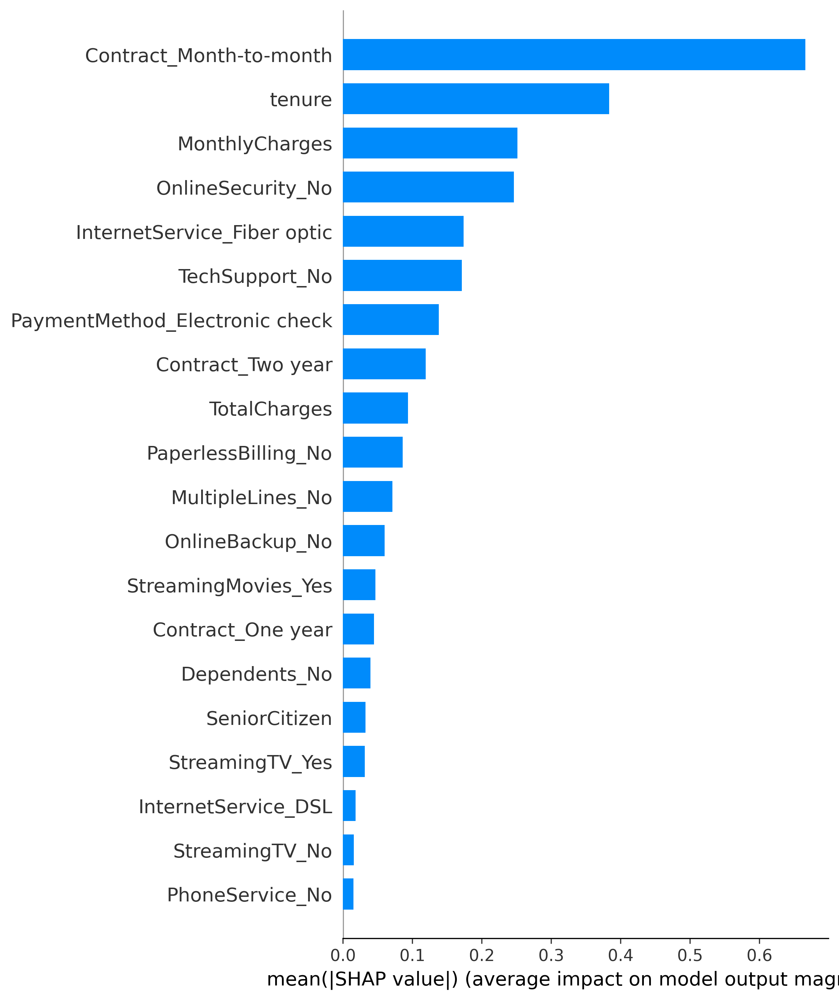
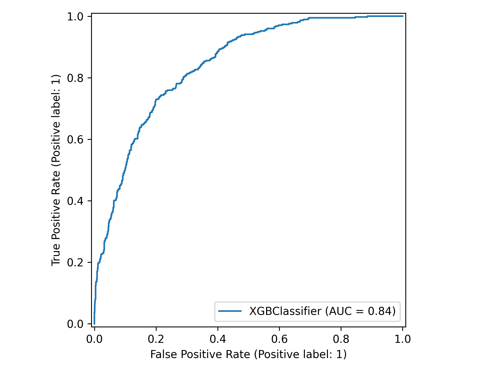
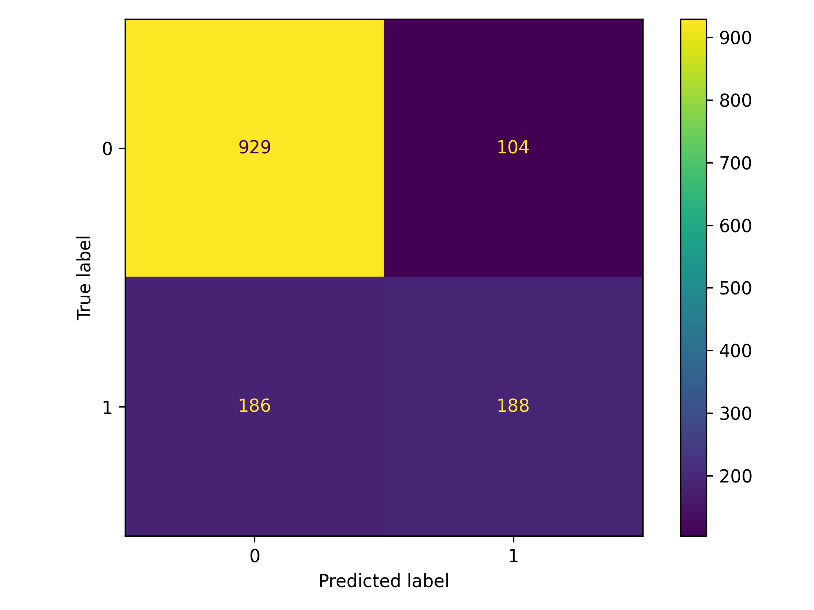
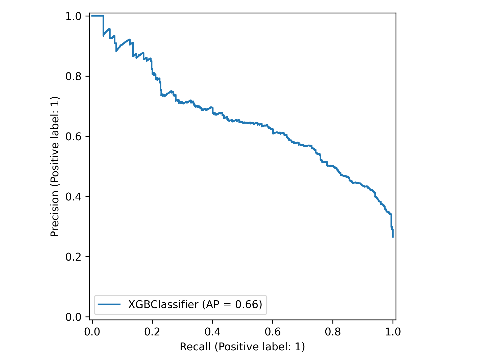

# 📊 Customer Churn Prediction using Machine Learning


An end-to-end Machine Learning project that predicts customer churn using the **IBM Telco Customer Churn Dataset**. This project demonstrates the complete data science lifecycle—from data preprocessing and exploratory data analysis to feature engineering, model development, hyperparameter tuning, explainable AI, deployment-ready pipelines, and an interactive Streamlit application.

---

# 🚀 Highlights

* ✅ End-to-End Machine Learning Pipeline
* ✅ Automated Data Cleaning & Preprocessing
* ✅ Exploratory Data Analysis (EDA)
* ✅ Feature Engineering
* ✅ Multiple Machine Learning Models
* ✅ Hyperparameter Tuning with GridSearchCV
* ✅ SHAP Explainability
* ✅ Feature Importance Analysis
* ✅ Automated Evaluation Reports
* ✅ Production-Ready Scikit-learn Pipeline
* ✅ Streamlit Web Application
* ✅ Modular Python Codebase

---

# 📈 Results

| Best Model              |   Accuracy |   ROC-AUC |  Precision |     Recall |   F1 Score |
| ----------------------- | ---------: | --------: | ---------: | ---------: | ---------: |
| **Logistic Regression** | **80.38%** | **0.836** | **64.85%** | **57.22%** | **60.80%** |
| Random Forest           |     79.18% |     0.830 |     63.11% |     52.14% |     57.10% |
| Tuned XGBoost           |     79.39% |     0.840 |     64.38% |     50.27% |     56.46% |

---

# 📂 Project Structure

```text
CustomerAnalytics/

├── app.py                     # Streamlit application
├── main.py                    # Project entry point
├── requirements.txt
├── README.md
├── LICENSE
│
├── data/
│   └── WA_Fn-UseC_-Telco-Customer-Churn.csv
│
├── models/
│   ├── customer_churn_pipeline.pkl
│   ├── logistic_regression.pkl
│   └── random_forest.pkl
│
├── outputs/
│   ├── churn_distribution.png
│   ├── feature_importance.png
│   ├── shap_summary.png
│   ├── shap_bar.png
│   ├── logistic_confusion_matrix.png
│   ├── logistic_roc_curve.png
│   ├── logistic_pr_curve.png
│   ├── xgboost_confusion_matrix.png
│   ├── xgboost_roc_curve.png
│   ├── xgboost_pr_curve.png
│   ├── model_comparison.csv
│   └── ...
│
├── reports/
│
└── src/
    ├── config.py
    ├── preprocessing.py
    ├── eda.py
    ├── feature_engineering.py
    ├── modeling.py
    ├── tuning.py
    ├── visualization.py
    ├── explainability.py
    ├── model_plots.py
    ├── evaluation.py
    ├── pipeline.py
    ├── pipeline_builder.py
    └── utils.py
```

---

# ⚙️ Machine Learning Workflow

```text
                     IBM Telco Customer Dataset
                                │
                                ▼
                    Data Inspection & Validation
                                │
                                ▼
                       Data Cleaning & EDA
                                │
                                ▼
                      Feature Engineering
                                │
                                ▼
                       Train / Test Split
                                │
                                ▼
                    ColumnTransformer Pipeline
            (One-Hot Encoding + Standard Scaling)
                                │
                                ▼
                      Machine Learning Models
          ┌─────────────┬──────────────┬─────────────┐
          │             │              │
          ▼             ▼              ▼
 Logistic Regression Random Forest  XGBoost
          │             │              │
          └─────────────┴──────────────┘
                        │
                        ▼
              Hyperparameter Optimization
                        │
                        ▼
              Model Evaluation & Comparison
                        │
                        ▼
          Feature Importance & SHAP Analysis
                        │
                        ▼
            Production Pipeline (.pkl Model)
                        │
                        ▼
              Interactive Streamlit Dashboard
```

---

# 📊 Dataset

**Dataset:** IBM Telco Customer Churn

| Property                | Value |
| ----------------------- | ----- |
| Samples                 | 7043  |
| Features                | 21    |
| Numerical Features      | 4     |
| Categorical Features    | 17    |
| Target                  | Churn |
| Missing Records Removed | 11    |

Target Variable:

* **Yes** → Customer Churned
* **No** → Customer Retained

---

# 🧹 Data Preprocessing

The preprocessing pipeline performs:

* Missing value handling
* Duplicate detection
* Data type correction
* Feature engineering
* One-Hot Encoding
* Standard Scaling
* Train-Test Split
* Production-ready preprocessing pipeline

---

# 📊 Exploratory Data Analysis

## Customer Churn Distribution



---

## Contract Type vs Customer Churn



---

## Internet Service vs Customer Churn



---

## Payment Method vs Customer Churn



---

# 🤖 Machine Learning Models

Implemented models:

* Logistic Regression
* Random Forest
* XGBoost
* Hyperparameter Optimization (GridSearchCV)

---

# 📈 Model Comparison

| Model               |   Accuracy |  Precision |     Recall |   F1 Score |   ROC-AUC |
| ------------------- | ---------: | ---------: | ---------: | ---------: | --------: |
| Logistic Regression | **80.38%** | **64.85%** | **57.22%** | **60.80%** | **0.836** |
| Random Forest       |     79.18% |     63.11% |     52.14% |     57.10% |     0.830 |
| Tuned XGBoost       |     79.39% |     64.38% |     50.27% |     56.46% | **0.840** |

---

# 📊 Feature Importance

The XGBoost model identified the following as the strongest predictors of customer churn:

* Month-to-Month Contract
* Online Security
* Fiber Optic Internet
* Tech Support
* Customer Tenure
* Electronic Check Payment
* Total Charges

### XGBoost Feature Importance



---

# 🔍 Explainable AI (SHAP)

To improve model interpretability, SHAP (SHapley Additive exPlanations) was used to understand the contribution of each feature towards customer churn predictions.

### SHAP Summary Plot



---

### SHAP Feature Importance



---

# 📉 Model Evaluation

## ROC Curve



---

## Confusion Matrix



---

## Precision-Recall Curve



---

# 💡 Key Business Insights

Exploratory Data Analysis and Machine Learning revealed:

* Customers with **Month-to-Month contracts** have the highest churn rate.
* Customers using **Electronic Check** payment churn significantly more frequently.
* **Fiber Optic** customers exhibit higher churn compared to DSL customers.
* Lack of **Online Security** strongly correlates with churn.
* Customers without **Tech Support** are more likely to leave.
* Longer customer **tenure** significantly reduces churn risk.
* Gender has minimal impact on churn behavior.

---

# 🖥 Streamlit Dashboard

Launch the application using:

```bash
streamlit run app.py
```

The application enables users to:

* Predict customer churn
* View churn probability
* Perform real-time inference using the trained ML pipeline

---

# ⚙️ Installation

Clone the repository:

```bash
git clone https://github.com/oreomcflurryyy/CustomerAnalytics.git
```

Move into the project:

```bash
cd CustomerAnalytics
```

Create a virtual environment (optional but recommended):

```bash
python -m venv venv
```

Activate the environment:

Windows

```bash
venv\Scripts\activate
```

macOS/Linux

```bash
source venv/bin/activate
```

Install dependencies:

```bash
pip install -r requirements.txt
```

Run the complete pipeline:

```bash
python main.py
```

Run the Streamlit application:

```bash
streamlit run app.py
```

---

# 📁 Generated Outputs

Running the pipeline automatically generates:

### Models

* customer_churn_pipeline.pkl
* logistic_regression.pkl
* random_forest.pkl

### Reports

* Model Comparison CSV
* Feature Importance Plot
* SHAP Summary Plot
* SHAP Feature Importance Plot
* ROC Curves
* Precision-Recall Curves
* Confusion Matrices
* EDA Visualizations

---

# 🛠 Technologies Used

* Python
* Pandas
* NumPy
* Matplotlib
* Scikit-learn
* XGBoost
* SHAP
* Streamlit
* Joblib
* Git
* GitHub

---

# 🚀 Future Improvements

* Docker Containerization
* FastAPI REST API
* MLflow Experiment Tracking
* GitHub Actions CI/CD
* Cloud Deployment (AWS / Render)
* Automated Model Retraining
* Interactive SHAP Explanations in Streamlit

---

# 👩‍💻 Author

**Eshanika Dey**

B.Tech, Bioscience & Biotechnology

**Indian Institute of Technology Kharagpur**

### Interests

* Bioinformatics
* Machine Learning
* Data Science

---

## ⭐ Support

If you found this project useful, consider giving the repository a **star**. It helps others discover the project and supports future development.
